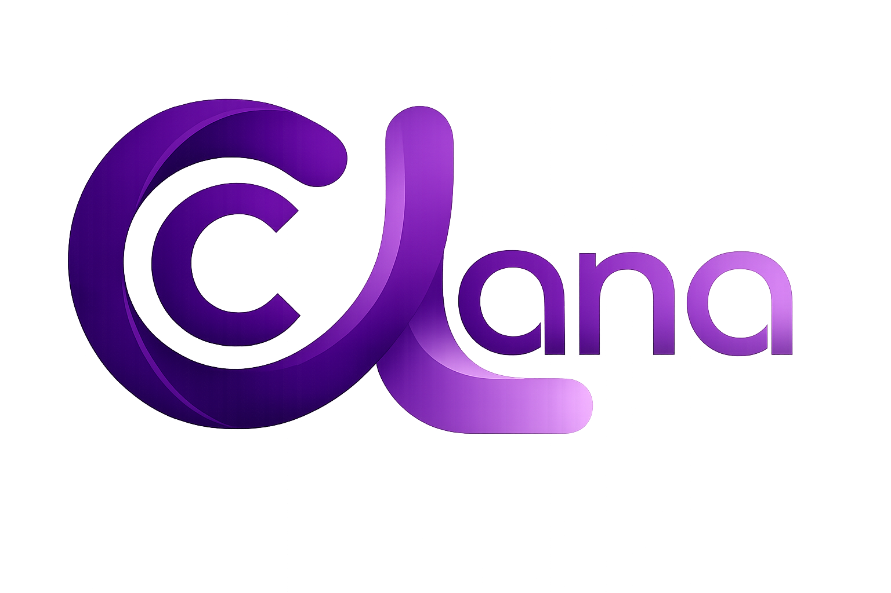

# 🚀 Call Lana - Vollständiges Website-Package

## 📦 Inhalt

Dieses Package enthält die **komplette Call Lana Website** mit allen Updates und Korrekturen.

### ✅ Alle HTML-Seiten:
- `index.html` - Startseite (mehrsprachig, neue Kundenliste)
- `login.html` - Bestandskunden-Login
- `registrierung.html` - Neuregistrierung
- `dashboard.html` - Dashboard (Logout → Startseite)
- `funktionen.html` - Features-Übersicht
- `branchen.html` - Branchen-Übersicht
- `preise.html` - Preisübersicht
- `kontakt.html` - Kontaktformular
- `settings.html` - Einstellungen
- `impressum.html` - Impressum (Wetzellplatz 2, Hildesheim)
- `datenschutz.html` - Datenschutzerklärung
- `agb.html` - AGB

### ✅ JavaScript:
- `i18n.js` - Mehrsprachigkeitssystem (DE/EN)
- `supabase-config.js` - Supabase Konfiguration

### ✅ Dokumentation:
- `README.md` - Diese Datei
- `UPDATES.md` - Changelog aller Änderungen
- `FILE_LIST.txt` - Dateiübersicht

---

## 🎯 Was wurde geändert

### 1. Firmenname & Domain
- ✅ **Call Lana** (statt cLana)
- ✅ **www.call-lana.de** (statt clana.ai)
- ✅ **CL Logo** (statt c)

### 2. Firmenadresse
- ✅ **Wetzellplatz 2, 31134 Hildesheim**

### 3. Mehrsprachigkeit
- ✅ DE/EN Language Switcher
- ✅ Automatische Spracherkennung
- ✅ LocalStorage-Speicherung

### 4. Kundenliste (Startseite)
- ✅ **TerpZero**
- ✅ **SalesStaff**
- ✅ **DCR-Agentur**
- ✅ **Brillen.de**
- ✅ **RS Solutions**
- ❌ "5.000 Unternehmen" entfernt
- ❌ TrustPilot entfernt

### 5. Dashboard
- ✅ Logout führt zu `index.html`
- ✅ Session-Check
- ✅ User-Info-Display

---

## 🚀 Installation

### Option 1: Netlify Drop (empfohlen)
```bash
1. Gehe zu https://app.netlify.com/drop
2. Ziehe ALLE Dateien ins Fenster
3. Fertig! Deine URL: https://xyz.netlify.app
```

### Option 2: Manuell
```bash
# 1. Dateien auf deinen Server hochladen
scp -r * user@server:/var/www/call-lana/

# 2. Webserver neu starten
sudo systemctl restart nginx
```

### Option 3: Lokal testen
```bash
# Im Verzeichnis:
python3 -m http.server 8000

# Öffne: http://localhost:8000
```

---

## 🌍 Mehrsprachigkeit einrichten

### Schritt 1: i18n.js ist bereits eingebunden
Alle Dateien haben bereits:
```html
<script src="i18n.js"></script>
```

### Schritt 2: Language Switcher ist aktiv
Oben rechts auf jeder Seite: **DE / EN**

### Schritt 3: Neue Sprache hinzufügen (optional)
In `i18n.js`:
```javascript
const translations = {
  de: { ... },
  en: { ... },
  fr: {  // NEU
    'nav.home': 'Accueil',
    // ...
  }
};
```

---

## 🔐 Supabase Setup

### 1. Dein Supabase Projekt
URL: `https://odcyprmamhlsadsaoqfq.supabase.co`

### 2. SQL Migrations ausführen
Im Supabase Dashboard → SQL Editor:

**Führe aus:**
1. Alle SQL aus früheren Migrations (siehe DEPLOYMENT.md im alten Package)
2. Prüfe Tabellen: `profiles`, `transactions`, `subscriptions`

### 3. Secrets setzen
```bash
supabase secrets set STRIPE_SECRET_KEY=sk_test_...
supabase secrets set STRIPE_WEBHOOK_SECRET=whsec_...
```

---

## 📋 Deployment Checklist

### Pre-Launch:
- [ ] Alle Branding-Änderungen geprüft (Call Lana, Logo CL)
- [ ] Kundenliste korrekt (5 echte Unternehmen)
- [ ] TrustPilot entfernt
- [ ] Mehrsprachigkeit funktioniert (DE/EN Switcher)
- [ ] Logout führt zu Startseite
- [ ] Supabase Verbindung aktiv

### Post-Launch:
- [ ] DNS für call-lana.de eingerichtet
- [ ] SSL-Zertifikat aktiv
- [ ] Email-Adressen @call-lana.de erstellt
- [ ] Stripe Webhooks konfiguriert
- [ ] Google Analytics / Tracking (optional)

---

## 🎨 Customization

### Farben ändern
In jeder HTML-Datei im `<style>` Block:
```css
:root {
  --pu: #7c3aed;  /* Primary Purple */
  --pu3: #c084fc; /* Light Purple */
  --cyan: #22d3ee; /* Accent Cyan */
}
```

### Logo austauschen
Suche nach `.logo-mark` in allen Dateien und ändere:
```html
<div class="logo-mark">CL</div>
<!-- Oder ersetze mit Bild: -->

```

### Telefonnummern ändern
Suche in allen Dateien nach:
- Demo: `+49 5121 206 789`
- Support: Aktualisiere in kontakt.html

---

## 🐛 Troubleshooting

### Language Switcher funktioniert nicht
```javascript
// Prüfe Browser Console (F12)
// Fehler: "i18n is not defined"?
// → i18n.js wurde nicht geladen

// Fix: Prüfe Pfad
<script src="i18n.js"></script>
```

### Login funktioniert nicht
```javascript
// Prüfe Supabase Config
console.log(supabaseClient);

// Fehler: "supabaseClient is not defined"?
// → supabase-config.js wurde nicht geladen

// Fix:
<script src="supabase-config.js"></script>
```

### Logout führt nicht zur Startseite
```javascript
// Prüfe dashboard.html
// Zeile ~125:
window.location.href = 'index.html'; // ✓ Korrekt
```

---

## 📞 Support

**Probleme oder Fragen?**
- Email: support@call-lana.de
- Dokumentation: Siehe UPDATES.md

---

## 📄 Lizenz

© 2026 Call Lana GmbH - Alle Rechte vorbehalten

---

## ✅ Quick Start

```bash
# 1. ZIP entpacken
unzip call-lana-complete.zip

# 2. Lokal testen
cd call-lana-complete
python3 -m http.server 8000

# 3. Browser öffnen
open http://localhost:8000

# 4. Prüfen:
# - Language Switcher (DE/EN)
# - Kundenliste (5 echte Unternehmen)
# - Kein TrustPilot
# - Login → Dashboard
# - Logout → Startseite

# 5. Deployen
netlify deploy --prod
```

**Fertig!** 🎉
